# Prerequisites

The only assumption we make for this tutorial is that you have GROMACS and Pymol installed in your computer. For our case we are using Ubuntu 18.04, GROMACS 2018.3 and Pymol 1.8.

# Pymol Basics

## Proteins

We are going to start with some pymol basics based on an enzyme called Mouse Thymidylate Synthase this enzyme catalyzes the conversion of deoxyuridine monophosphate (dUMP) to deoxythymidine monophosphate (dTMP). So, the first thing we are going to do is start a log file, download the protein from the protein data bank, remove the solvent and visualize it. Using the pymol terminal type: 

```
log_open log.pml
fetch 6F6Z
hide
remove solvent
show cartoon, 6F6Z
```

Most of the features in pymol can be typed in or selected in the Pymol viewer. Say for example we would like to change the color of our protein we could type: `color cyan, 6F6Z` or we could select in the Viewer by going to 6F6Z then clicking c (color) going down cyans and then cyan. For now, we are going to select `c` then `by ss` and finally `Helix (cyan) Sheet (magenta) Loop (pink) `. Notice that if you select color by chain you can see that our protein is composed of two chains.

<p align="center">
  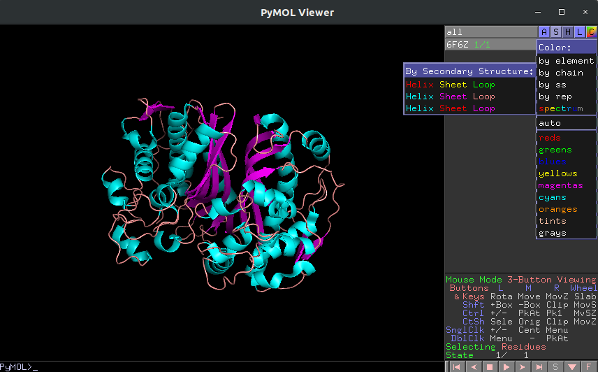
</p>

As you can see now we have our protein not only showing its secondary structure but also in different color, so we can distinguish it. Now we are going to focus on the ligands click on the letter S of the pymol viewer at the bottom right side of the screen a scroll bar should appear on top of the screen, her you can look and select every residue of your .pdb file. Scroll all the way to the right, you should see 4 residues named NOH and TGQ. 

<p align="center">
  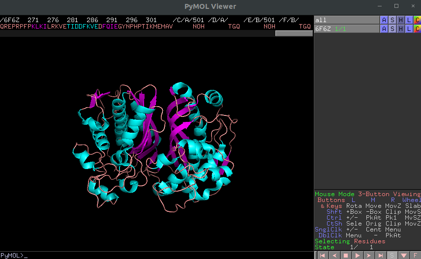
</p>

Now that we know the names of our ligands we are going to select them using the terminal.

```
select lig1, resn NOH
select lig2, resn TGQ
```

You should know see in the viewer two new rows under 6F6Z, notice that know we can apply individual actions to our new selections. In this case we used resn or resname to select our residues we could have also used resi which looks for the specific residue number. Now let’s represent our ligands as spheres. 

```
show spheres, lig1
show spheres, lig2
set sphere_scale, 0.7
```

We can color them using the viewer selecting `color by element` and select any color we like. Notice we also changed the size of our spheres from a default of 1 to 0.7. Finally, we are going to select our protein (6F6Z) to show its accessible surface. In the viewer select the letter s (show) on the top right and select surface.  


<p align="center">
  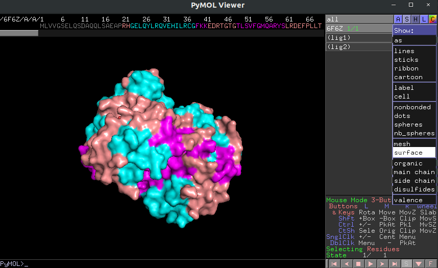
</p>

Now we are ready to create a nice picture. Change the color of the protein to gray80 here, since we never defined the protein properly we must change the color of our ligands again to any color by element. Now we are going to look at the options we have on top of the pymol terminal window. Select display then background, set the background color to white and unselect the opaque option. Now select display then quality and select max quality. Now go to setting then transparency then surface and select 50. Finally go to scene then cache and select optimize. Now we are going to ray trace our image, this setting has many options depending on what you want so we suggest reading the documentation in pymol. For now, lest only test ray_trace_mode.

```
set ray_trace_mode, 1
ray 2000
```

Now that our image is ray traced we cannot move it otherwise we would have to repeat the last line of code. To save the image just type `png filename.png` now that you saved it you can move around to get another snap not forgetting to ray trace it before saving. Notice that we used ray 2000 this creates an image of 2000x1356 in this case we only controlled the width, but you can control both dimensions if you type `ray 2000,1356` change the ray_trace_mode from 0 to 3 an see what type of images you can get. Finally close pymol and check the log file we created at the beginning it should have all the commands you typed and also the ones you instructed with the mouse.


<p align="center">
  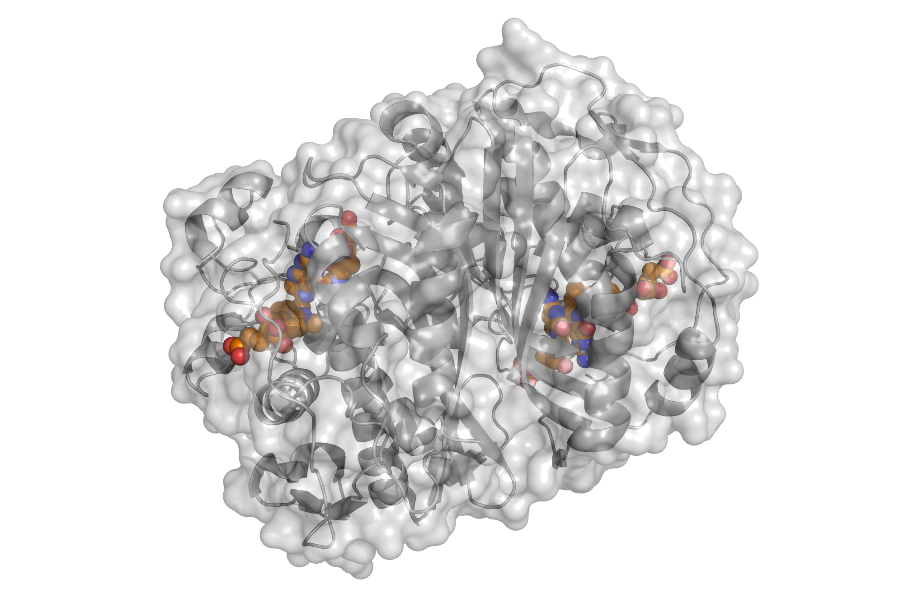
</p>
<p align="center">
  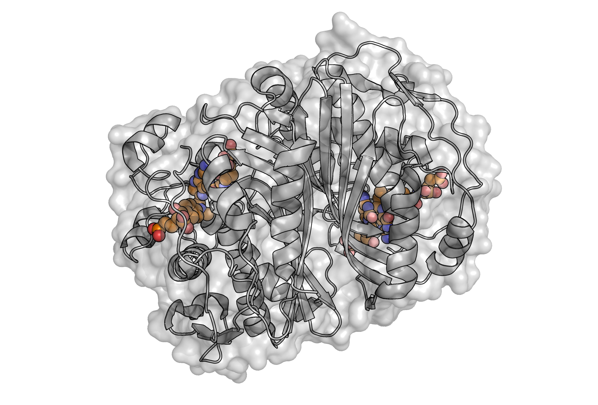
</p>

## Membranes

In this section we are going to go over the basics on how to make a molecular dynamics simulation using GROMACS and the charmm force field. We begin by going to the following webpage [charmm-gui](http://www.charmm-gui.org/). Here we select input generator followed by membrane builder, scroll down and then select membrane only system. Follow the next image closely.

<p align="center">
  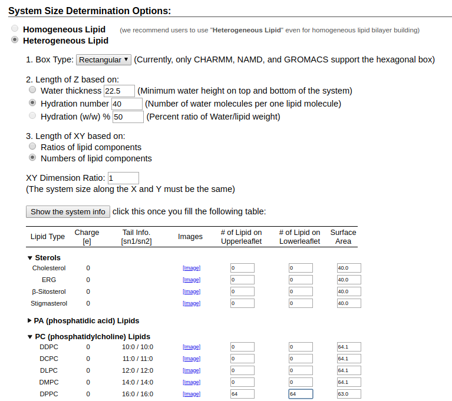
</p>

After adding the number of lipids in this case 64 DPPC lipids in each leaflet, press show system info and then next step. Here the only change we are going to make is changing KCl for NaCl. Press next step until you see the following screen:

<p align="center">
  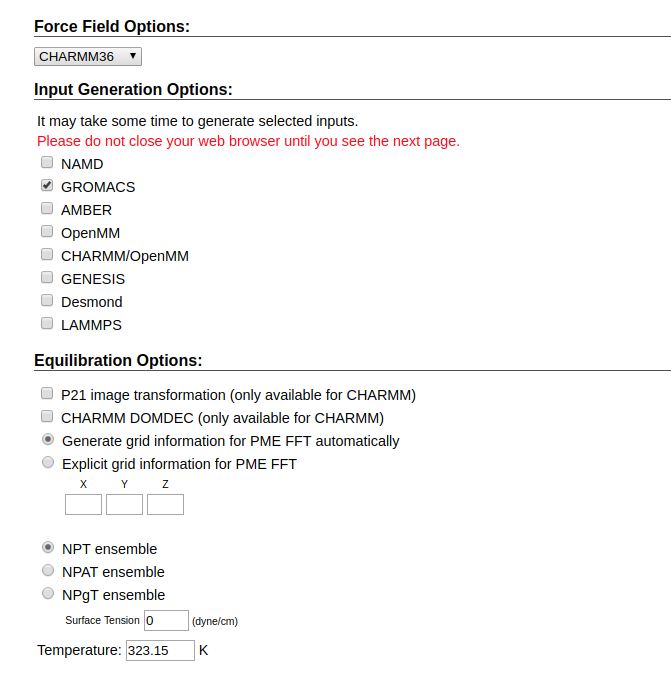
</p>

Change all your setting to match the image and click on next step. When this step is done download and extract the files. Then copy the gromacs folder (the one inside what you just downloaded) to your working directory. Now you have to run the energy minimization .mdp using gromacs.


```
gmx grompp -f step6.0_minimization.mdp -o step6.0_minimization.tpr -c step5_charmm2gmx.pdb -p topol.top -r step5_charmm2gmx.pdb -maxwarn -1
gmx mdrun -v -deffnm step6.0_minimization
```
Now that you have your system in a local minimum you have to equilibrate it by slowly releasing it from the restrains for this we are going to run a series of 6 steps:

```
gmx grompp -f step6.1_equilibration.mdp -o step6.1_equilibration.tpr -c step6.0_minimization.gro -p topol.top -n index.ndx -r step5_charmm2gmx.pdb -maxwarn -1
gmx mdrun -v -deffnm step6.1_equilibration
```
Run this same code changing the flags for each step considering that the restrictions, topology and index files never change and the -c flag is the final conformation of the previous step, -f is your next .mdp file and -o your desire output. You can look at the trajectories you are generating at every step by opening the .gro file with pymol and the typing the following in the pymol terminal:

```
load_traj step6.3_equilibration.trr, step6.3_equilibration
```

When you are done with all the equilibration steps the next step is the actual simulation or the production run for this we will have to modify the step7_production.mdp file at this point if you are a beginner it is best to edit the file with a supervisor since this file is very specific for every project. Once you have edited this file you can use grompp followed by mdrun in the same way we did for the equilibration steps. Normally production runs are run in a cluster to decrease the wall time. At the end of the production run our trajectory would normally be written to a .xtc file meaning it has double precision. We can look at the trajectory using pymol again. Many tutorials on analyzing trajectories globally can be found in the internet, however, in this tutorial we would like to focus on local properties. So, I suggest you first go to the [tutorial](https://mptg-cbp.github.io/teaching/tutorials/membranes/index.html) by Camilo Aponte-Santamaria and follow it from section B all you need is your final .gro file and .xtc file. You can convert analogous file types with the gromacs command:

```
gmx editconf -f filename.gro -n index.ndx -o filename.pdb
```

At this point we assumed you did the four analysis at Camilo's page (area per lipid, thickness, order parameter and difusion) we will now check this same properties locally.

### g_lomepro

The first thing we are going to do is download g_lomepro<sup>[1](#footnote1)</sup> a software developed by Vytautas Gapsys, Bert L. de Groot, Rodolfo Briones to calculate local properties of membranes. This link will take you to their website: [g_lomepro](http://www3.mpibpc.mpg.de/groups/de_groot/g_lomepro.html). Once you downloaded it unzip it and now we need to copy some files from a gromacs library to make sure the local version of the program runs correctly. Type the following in your command prompt:

```
locate residuetypes.dat
```
You should see at least one result in your terminal, follow this path an copy everything form the folder named 'top' to folder of g_lomepro. If you done this correctly you should be able to run the following command from the g_lomepro folder:

```
./g_lomepro_static_v1.0.2 
```

You should see all the documentation of the program with an error message at the end saying it cannot open file tpr.tpr. Now we are gonna change some thing from our .xtc file.

```
gmx trjconv -f step7_production.xtc -s step7_production.tpr -n index.ndx -o run.xtc -pbc mol 
```

At this point the last thing we need is to generate an index file selecting the phosphorus atom of every lipid since we are gonna perform all the calculations just using this atom positions, we can do this with gromacs.

```
gmx make_ndx -f step7_production.gro -o p.ndx 
```
This will open gromacs in the terminal where you need to select the group if your membrane group is number 2 type the following '2 & a p' then you can delete all the other selection with del for our case the command would be 'del 0-5', then we type 'q' and hit enter. Now you want to grab the index file the .xtc file and the .gro file and copy them inside the g_lomepro folder.

```
./g_lomepro_static_v1.0.2 -f step6.6_equilibration.trr -n p.ndx -s step6.6_equilibration.gro -apl -lip_num 128 -binx 50 -biny 50
```
This is going to generate multiple files we are interested in apl.out_avg.pdb, open the file using pymol. Change the representation to spheres and then type in the pymol terminal:

```
set sphere_scale, 0.5
spectrum b, blue_white_red
set ray_trace_mode, 3
set ray_shadow, off
```
Move the image around until you are confident enough to take a picture the run:

```
ray 5000
```
and save the image as a png. Repeat the same but this time calculate the thickness locally. Play around with the color by typing spectrum b, and hitting tab. Your results should look similar to this:

<p align="center">
  
</p>
<p align="center">
  
</p>

Now we have to change our index file if we want to calculate the order parameter since it is a function of the position of the carbon atoms in the acyl chains of the lipids, the best way to do this is going opening the .gro file in pymol then hide everything and 'show sticks, resi 1' then in the bottom right in selecting change it from residues to atoms by clicking it. Now press every atom you are going to need in your index file for our case is the carbon atoms of the acyl chains after selecting them all it should look like this:

<p align="center">
  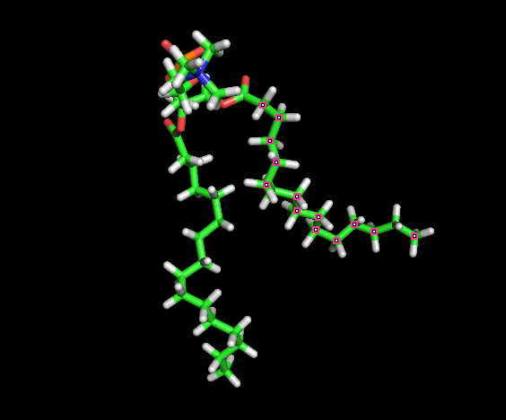
</p>

If you notice everytime we select an atom pymol shows you the atom name for our case sn1 goes from C22 to C216 and sn2 C32 to C316. Now we create the index files with make_ndx entering the membrane group (2) followed by & a C22 C23 all the way to C216 and we can do the same for sn2 in the same index file then delete all the other groups with del except the membrane group. After this we should have and index file with 3 groups the membrane, sn1 and sn2. We then copy this file to the g_lomepro folder. Then we can run the same command as for area per lipid by changing apl for order then the program will ask you to select the lipid group based on the group number in our case it was 0 then the sn1 group (1) and sn2 (2), this calculation is more intensive than the previous time so the wait time is much longer. When it is done we will be looking only at the .pdb files and you can notice there are going to be divided by chain so we are going to visualize it separately first the sn1 open order.out_avg_sn1_atom2.pdb with pymol. Then typy in the pymol terminal the following:

```
load order.out_avg_sn1_atom4.pdb
```
Repeat this command for all pair atoms in the sn1 chain. Then click show all as spheres and set the sphere scale to 0.3 in the terminal finally also for all select color, spectrum and then b factor. In the terminal adjust the color of the spectrum bar, then change the background and prepare everything for a nice picture. Ray trace your image with shadows off and save it as a png. Think about a good way of looking at the order parameter locally of course in a membrane with just lipids everything looks homogeneus in x and y however you can see the global effect of moving in the z direction. 

<p align="center">
  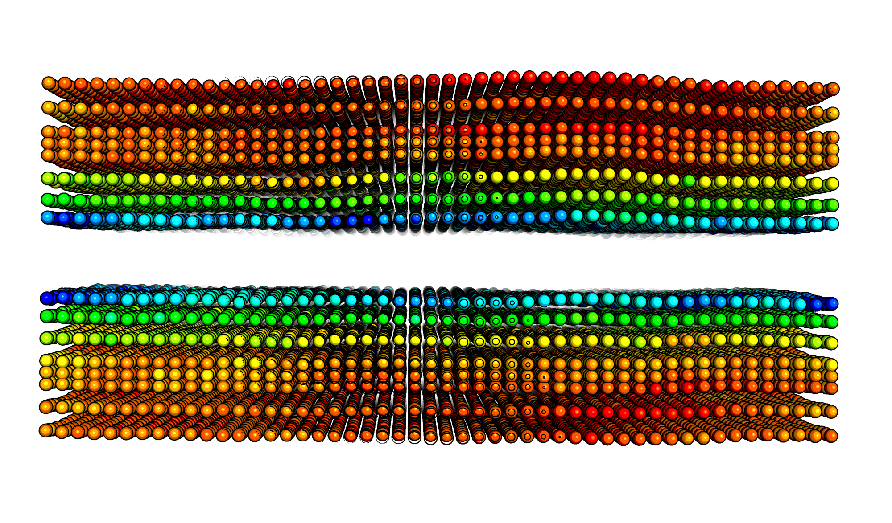
</p>

<p align="center">
  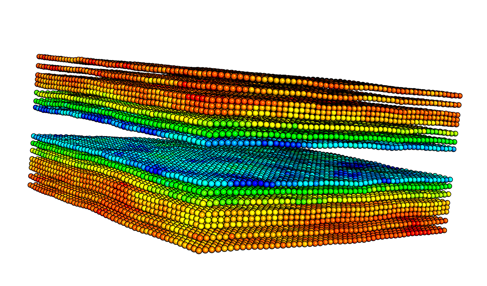
</p>

### MDanalysis

For the difussion local analogous we are going to use mdanalysis a molecular dynamics library for python. You can install it running in your terminal:

```
pip install --upgrade MDAnalysis
```
This part of the analysis demands previous knowledge of python, if you are not familiar I suggest skipping to the next section. MDAnalysis has a function call streamlines that returns the positions and velocities of a particular selection. In our case we picked the phosphorus atom of the lipids with this information we can then use streamlines from matplotlib to generate the following plot: 

<p align="center">
  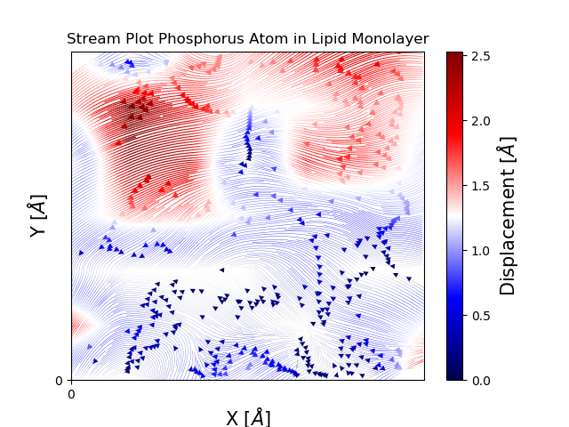
</p>

Notice that the plot only captures an instant in time however we can do a loop over a specific range of time to create a movie. The python code for this particular case can be seen in the jupyter notebook in the github repository.

## Membrane-Protein 

<a name="footnote1">1</a>: Check the article about g_lomepro. [Vytautas Paper](https://www.ncbi.nlm.nih.gov/pmc/articles/PMC3882000/ "ncbi"). 
